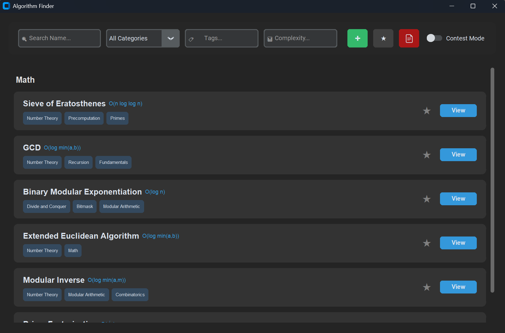
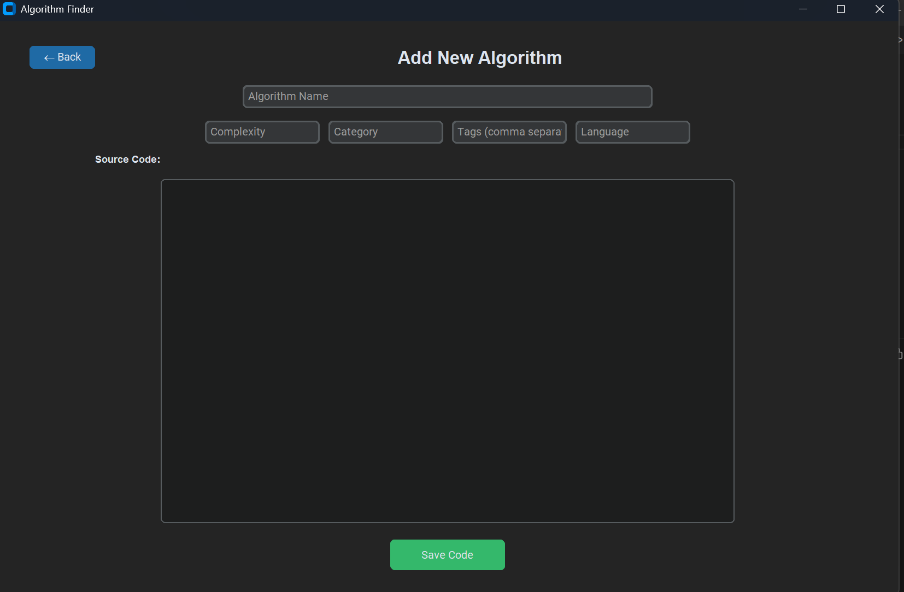
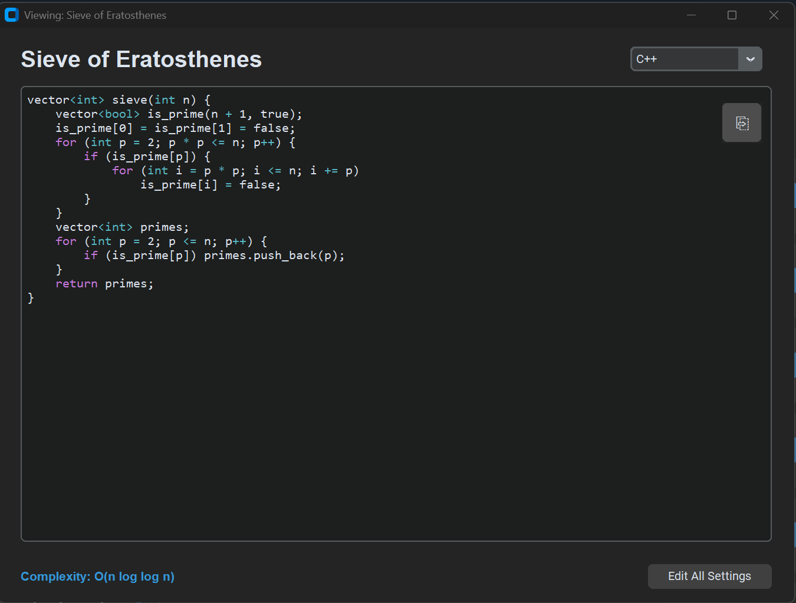

# 🔍 Algorithm Finder Pro


**Algorithm Finder Pro** is a modern, high-performance desktop application designed for developers and competitive programmers. It allows you to build a personal library of algorithms with multi-language support, smart filtering, and professional PDF exports[cite: 1, 2, 8].

---

## 📸 Screenshots

*(Replace these placeholder links once you upload your images to the `assets/` folder)*

**Main Dashboard & Search**


**Adding New Algorithms**


**Syntax Highlighted Code View**


---

## 🚀 How to Run

### Option 1: Standalone Executable (Recommended)
If you have the compiled version, simply locate the file and run:
1. Open the folder containing the application dist/.
2. Double-click **Algorithm Finder.exe**.
3. The application will automatically create an `algorithms.json` file in the same directory to store your data.

### Option 2: Running from Source
1. Install dependencies:
   ```bash
   pip install -r requirements.txt
   ```
2. Run the application:
    ```bash
    python src/main.py
    ```

---

## ✨ Key Features

* **Smart Grouping**: Algorithms are automatically grouped by category for a clean, organized view[cite: 8].
* **Live Syntax Highlighting**: Automatic code colorization for Python, C++, Java, and more during both viewing and adding[cite: 5, 8].
* **Contest Mode**: A focused environment that hides complexities and tags to simulate a real competition setting[cite: 4, 8].
* **Multi-Language Support**: Store different language implementations (e.g., Python and C++) for the same algorithm[cite: 6, 7].
* **PDF Export**: Generate professional, syntax-highlighted PDF reports of your library or just your favorites, organized by category[cite: 8].

---

## 🗂️ Project Structure

* **`Algorithm Finder.exe`**: The standalone application.
* **`src/`**: Contains the source code including the entry point `main.py`[cite: 3].
* **`src/app.py`**: The main application controller managing view transitions[cite: 1].
* **`src/database.py`**: Handles JSON data persistence and search logic[cite: 2].
* **`src/views/`**: Contains UI modules for Searching, Adding, and Editing[cite: 6, 7, 8].
* **`assets/`**: Folder for README screenshots and icons.
* **`algorithms.json`**: The local database file where your data is saved[cite: 2].

---

## 📜 License
Distributed under the MIT License. See `LICENSE` for more information.